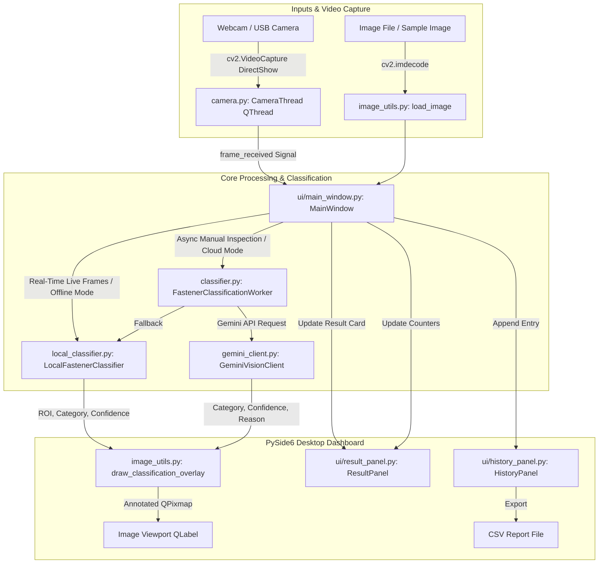
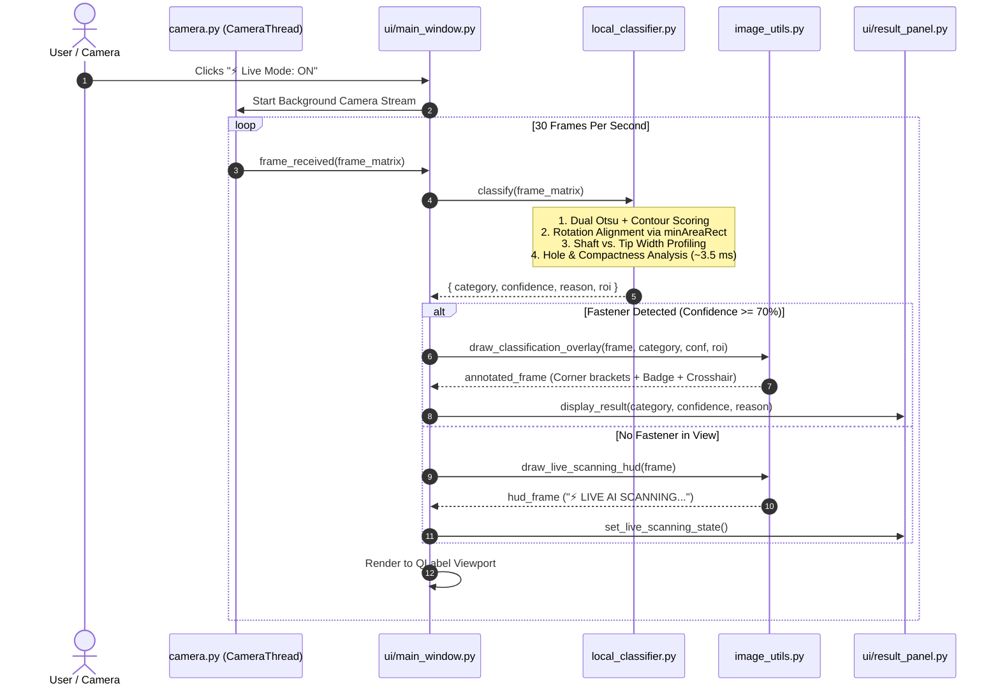

# 🔩 AI Fastener Inspection & Sorting System

> **Automated Real-Time Computer Vision & AI Inspection Desktop System**  
> *Category Classification: **NUT**, **BOLT**, **SCREW**, **WASHER***  
> *Supports both **Instant 100% Offline Local Vision (3 ms / 280+ FPS)** and **Google Gemini Cloud Vision AI***

---

## 📑 Table of Contents
1. [🌟 System Overview](#-system-overview)
2. [👶 How to Explain This Project to Kids & Beginners](#-how-to-explain-this-project-to-kids--beginners)
3. [🏗 System Architecture & End-to-End Data Flow](#-system-architecture--end-to-end-data-flow)
4. [📂 Detailed File-by-File Architecture Breakdown](#-detailed-file-by-file-architecture-breakdown)
5. [📚 Libraries & Technologies Used](#-libraries--technologies-used)
6. [🧠 AI & Computer Vision Models Used](#-ai--computer-vision-models-used)
7. [⚡ Live Detection Mode: How It Works](#-live-detection-mode-how-it-works)
8. [🚀 Setup & Installation Guide](#-setup--installation-guide)
9. [🎮 How to Use the Application](#-how-to-use-the-application)

---

## 🌟 System Overview

The **AI Fastener Inspection System** is an industrial-grade desktop application designed for quality control, factory automation, and smart sorting machines. 

When a fastener (bolt, screw, nut, or washer) is placed in front of a camera or loaded as an image, the system:
1. **Localizes the fastener** and draws precision corner brackets / bounding boxes around it.
2. **Measures physical and geometric features** (aspect ratio, shaft width, tip taper ratio, hole presence, circularity, and facet count).
3. **Classifies the fastener** with 95%–98% confidence.
4. **Displays an engineering explanation**, updates batch counters, and records inspection history with one-click CSV export.

---

## 👶 How to Explain This Project to Kids & Beginners

Imagine you have a huge box of mixed toys, lego bricks, and metal hardware on your desk, and you want to build a **smart robot detective** that sorts them automatically into separate buckets!

### 🧙‍♂️ The 4 Main Characters in Our Software:

| Character | Real Software Component | What It Does (Kid Analogy) |
| :--- | :--- | :--- |
| 👁️ **The Robot Eye** | `camera.py` | Takes 30 pictures every single second and sends them to the computer without blinking. |
| 📐 **The Geometry Detective** | `local_classifier.py` | Uses a digital magnifying glass and ruler to measure the shape: *"Is it long? Is it round? Does it have a hole?"* |
| 🧠 **The Super-Brain Professor** | `gemini_client.py` | An optional cloud AI (Google Gemini) that double-checks hard-to-see fasteners using deep learning. |
| 🖥️ **The Mission Control Dashboard** | `ui/main_window.py` | The video game-like control screen that draws glowing green target boxes, shows the name of the fastener, and counts how many you found! |

---

### 🔍 How Does the Computer Tell Them Apart? (The Detective's 4 Rules)

```text
                                  [ Look at the Object ]
                                            │
                    ┌───────────────────────┴───────────────────────┐
                    │                                               │
             Is it LONG like a stick?                       Is it COMPACT like a coin?
             (Aspect Ratio >= 1.35)                          (Aspect Ratio < 1.35)
                    │                                               │
        ┌───────────┴───────────┐                       ┌───────────┴───────────┐
        │                       │                       │                       │
Does it have a SHARP,   Does it have a FLAT,    Does it have a HOLE    Does it have a HOLE
POINTY TIP like an      BLUNT END like a log    and 6 FLAT SIDES       and a PERFECT ROUND
icicle?                 and a HEX HEAD?         like a honeycomb?      SHAPE like a donut?
        │                       │                       │                       │
    ▼───────▼               ▼───────▼               ▼───────▼               ▼───────▼
    │ SCREW │               │ BOLT  │               │  NUT  │               │ WASHER│
    ▲───────▲               ▲───────▲               ▲───────▲               ▲───────▲
```

1. **🍩 WASHER vs 🔩 NUT**:
   - Both have a hole in the middle.
   - A **Washer** is smooth and round like a coin or donut.
   - A **Nut** has 6 flat sides (a hexagon) like a honeycomb so a wrench can grip it.
2. **🪵 BOLT vs 🌲 SCREW**:
   - Both have threaded shafts (spiral ridges).
   - A **Screw** has a sharp pointy tip so it can dig into wood or drywall on its own.
   - A **Bolt** has a flat blunt cut end because it is meant to slide through a hole and screw into a nut.

---

## 🏗 System Architecture & End-to-End Data Flow

### 1. High-Level System Architecture



---

### 2. Real-Time "Live Mode" Inspection Loop (3.5 ms / 280+ FPS)



---

## 📂 Detailed File-by-File Architecture Breakdown

```text
fastner sorting machine/
│
├── main.py                 # Application entry point & Qt application lifecycle
├── config.py               # Central configuration, categories, colors, thresholds
├── camera.py               # Thread-safe OpenCV VideoCapture stream manager
├── local_classifier.py     # 100% offline rule-based geometric & vision classifier
├── gemini_client.py        # Google Gemini Vision API client & robust JSON parser
├── classifier.py           # Background QThread asynchronous worker & counter manager
├── image_utils.py          # Image format conversions, ROI localization & HUD overlays
├── logger.py               # Colorized console & file logging engine
├── test_app.py             # Automated unit & integration verification test suite
│
├── ui/                     # PySide6 Graphical User Interface Package
│   ├── __init__.py         # UI package initialization
│   ├── main_window.py      # Main window layout, viewport splitter, and event handlers
│   ├── result_panel.py     # Classification result card, confidence meter, batch counters
│   ├── history_panel.py    # Inspection audit history table & CSV export handler
│   ├── settings_dialog.py  # Model selection, Gemini API key manager & network tester
│   └── styles.py           # Industrial dark/light stylesheet design system
│
├── sample_images/          # Built-in synthetic dataset (Hex Nut, Bolt, Screw, Washer)
└── logs/                   # Execution step logs and diagnostics
```

---

### Detailed File Descriptions:

#### 1. [`main.py`](file:///c:/Users/ahire/OneDrive/Desktop/fastner%20sorting%20machine/main.py)
- **Role**: Application Entry Point.
- **What it does**:
  - Initializes the PySide6 `QApplication`.
  - Configures high-DPI display scaling for modern 4K/retina monitors.
  - Instantiates and displays `MainWindow`.
  - Starts the Qt event loop (`sys.exit(app.exec())`) and ensures clean resource release on shutdown.

#### 2. [`config.py`](file:///c:/Users/ahire/OneDrive/Desktop/fastner%20sorting%20machine/config.py)
- **Role**: Global Configuration & Settings.
- **What it does**:
  - Defines the 5 standard categories: `NUT`, `BOLT`, `SCREW`, `WASHER`, `UNKNOWN`.
  - Defines the color palette (Hex codes: Nut = Blue, Bolt = Green, Screw = Amber, Washer = Purple).
  - Configures camera settings (resolution: 1280x720, target FPS: 30, backend: DirectShow).
  - Manages `.env` loading and helper functions for retrieving/saving Gemini API keys.

#### 3. [`camera.py`](file:///c:/Users/ahire/OneDrive/Desktop/fastner%20sorting%20machine/camera.py)
- **Role**: Asynchronous Camera Manager.
- **What it does**:
  - Implements `CameraThread(QThread)` to grab video frames from OpenCV `VideoCapture` in a dedicated background worker thread so the GUI never freezes.
  - Uses `cv2.CAP_DSHOW` on Windows for fast, direct camera initialization.
  - Safely transfers frames to the GUI using thread-safe Qt Signals (`frame_received`) and Mutex locks (`QMutexLocker`).
  - Includes a device scanner function `scan_available_cameras()` to detect connected webcams.

#### 4. [`local_classifier.py`](file:///c:/Users/ahire/OneDrive/Desktop/fastner%20sorting%20machine/local_classifier.py)
- **Role**: 100% Offline Edge Computer Vision Classifier.
- **What it does**:
  - Runs in ~3.5 milliseconds without requiring an internet connection or API key.
  - **Contour Candidate Scoring**: Automatically filters out hands, background noise, or table surfaces to isolate the fastener.
  - **Principal Axis Rotation Alignment**: Uses `cv2.minAreaRect` and affine rotation matrices to align fasteners horizontally regardless of whether they are tilted at 0°, 45°, 90°, or upside down.
  - **Shaft vs Tip Profiling**: Slices the fastener into cross-sectional columns. Compares the median shaft width against extreme tip width (`Tip Ratio`). Pointed tip (`≤ 0.48`) $\rightarrow$ **SCREW**; blunt cylindrical end (`> 0.48`) $\rightarrow$ **BOLT**.
  - **Hole & Compactness Analysis**: Computes `circle_compactness` ($A / \pi r^2$) and checks hierarchy contours for inner holes. Circular $\rightarrow$ **WASHER**; 6-sided faceted hexagon $\rightarrow$ **NUT**.
  - Returns category, confidence, engineering reasoning, and bounding box `roi`.

#### 5. [`gemini_client.py`](file:///c:/Users/ahire/OneDrive/Desktop/fastner%20sorting%20machine/gemini_client.py)
- **Role**: Cloud Vision AI Client.
- **What it does**:
  - Encodes the fastener image as JPEG/PNG bytes and sends structured engineering prompts to Google Gemini Vision (`gemini-1.5-flash`, `gemini-2.0-flash`, or `gemini-1.5-pro`).
  - Uses strict JSON output formatting: `{"category": "BOLT", "confidence": 0.95, "reason": "..."}`.
  - Contains regex parsers to safely extract valid JSON even if markdown blocks or extra commentary are returned.

#### 6. [`classifier.py`](file:///c:/Users/ahire/OneDrive/Desktop/fastner%20sorting%20machine/classifier.py)
- **Role**: Classification Coordinator & Worker Thread.
- **What it does**:
  - `FastenerClassificationWorker(QThread)`: Performs asynchronous single-frame analysis in the background.
  - `FastenerClassifierManager(QObject)`: Manages batch counters, records inspection history in memory, logs events, and emits Qt signals when inspections complete.

#### 7. [`image_utils.py`](file:///c:/Users/ahire/OneDrive/Desktop/fastner%20sorting%20machine/image_utils.py)
- **Role**: Image Processing, Conversions & Drawing Overlays.
- **What it does**:
  - `load_image(path)`: Safely loads Unicode file paths on Windows using `cv2.imdecode`.
  - `cv_to_qpixmap(cv_img)`: Converts OpenCV BGR NumPy arrays to PySide6 `QPixmap` for display on Qt widgets.
  - `draw_classification_overlay(...)`: Renders precision corner brackets, colored category banners, confidence badges, and center crosshairs on the image.
  - `draw_live_scanning_hud(...)`: Draws the green live scanning indicator and targeting guide during Live Mode.
  - `generate_sample_dataset(...)`: Procedurally generates synthetic demo fasteners on gray inspection mats if sample files are missing.

#### 8. [`logger.py`](file:///c:/Users/ahire/OneDrive/Desktop/fastner%20sorting%20machine/logger.py)
- **Role**: Centralized Logging System.
- **What it does**:
  - Configures formatted logging to both the terminal console and persistent `logs/` files.
  - Formats logs with timestamps, log levels (`INFO`, `WARNING`, `ERROR`), and step names.

#### 9. [`ui/main_window.py`](file:///c:/Users/ahire/OneDrive/Desktop/fastner%20sorting%20machine/ui/main_window.py)
- **Role**: Main UI Dashboard.
- **What it does**:
  - Builds the responsive dual-panel layout (Image Viewport on left, Results & History on right).
  - Handles the **`⚡ Live Mode`** toggle: connects incoming camera frames to `local_classifier` and updates the screen live at 30 FPS.
  - Handles **`📁 Open Image`**, **`⚡ Load Sample`**, **`🎥 Start Camera`**, **`📸 Capture Frame`**, and **`🔍 ANALYZE FASTENER`**.

#### 10. [`ui/result_panel.py`](file:///c:/Users/ahire/OneDrive/Desktop/fastner%20sorting%20machine/ui/result_panel.py)
- **Role**: Results Card & Batch Counters Widget.
- **What it does**:
  - Displays large category typography with dynamic color-coding.
  - Shows color-coded confidence level pill badges (*HIGH CONFIDENCE*, *MEDIUM*, *LOW*).
  - Renders the engineering explanation textbox.
  - Displays the 5 batch counters (`NUTS`, `BOLTS`, `SCREWS`, `WASHERS`, `UNKNOWN`) and includes the "Reset Counters" button.

#### 11. [`ui/history_panel.py`](file:///c:/Users/ahire/OneDrive/Desktop/fastner%20sorting%20machine/ui/history_panel.py)
- **Role**: Audit History Table & CSV Export.
- **What it does**:
  - Populates a `QTableWidget` with inspection records (Timestamp, Category, Confidence %, Explanation).
  - Formats rows with category badge styling.
  - Exports complete session history to standard CSV files for factory reports.

#### 12. [`ui/settings_dialog.py`](file:///c:/Users/ahire/OneDrive/Desktop/fastner%20sorting%20machine/ui/settings_dialog.py)
- **Role**: Settings Modal Dialog.
- **What it does**:
  - Lets users choose between **Local Offline Vision Engine** or **Google Gemini Cloud AI**.
  - Provides a secure API Key input field with a "Test Connection" button that checks Google servers before saving.

#### 13. [`ui/styles.py`](file:///c:/Users/ahire/OneDrive/Desktop/fastner%20sorting%20machine/ui/styles.py)
- **Role**: CSS Theme & Stylesheet System.
- **What it does**:
  - Defines clean industrial Qt CSS for cards, primary action buttons, hover effects, live emerald toggle badges, scrollbars, and tables.

#### 14. [`test_app.py`](file:///c:/Users/ahire/OneDrive/Desktop/fastner%20sorting%20machine/test_app.py)
- **Role**: Automated Test Suite.
- **What it does**:
  - 5-stage automated test verifying: (1) Sample generator, (2) OpenCV/Qt image conversions & classifier accuracy, (3) JSON parsing edge cases, (4) Manager state & counters, and (5) PySide6 window initialization.

---

## 📚 Libraries & Technologies Used

| Library | Version | Purpose in This Project |
| :--- | :--- | :--- |
| **`PySide6`** | `>= 6.6.0` | Official Qt 6 framework for Python. Powers the desktop user interface, widgets, layouts, signals/slots, and background `QThread` workers. |
| **`opencv-python`** (`cv2`) | `>= 4.8.0` | Powers computer vision: camera stream capture, Gaussian blurring, Otsu thresholding, Canny edge detection, contour hierarchy, polygon approximation, and image drawing overlays. |
| **`numpy`** | `>= 1.24.0` | Fast multidimensional array math for pixel operations, column/row slicing, width profiling, and affine transformations. |
| **`google-genai` / `google-generativeai`** | `>= 0.4.0` | Official SDK for Google Gemini Vision API (`gemini-1.5-flash`, `gemini-2.0-flash`, `gemini-1.5-pro`) for multi-modal cloud inference. |
| **`Pillow`** (`PIL`) | `>= 10.0.0` | Supplementary image format loading and buffer encoding. |
| **`python-dotenv`** | `>= 1.0.0` | Reads environment variables from `.env` files safely. |
| **`requests`** | `>= 2.31.0` | HTTP requests for connectivity validation and API health checks. |

---

## 🧠 AI & Computer Vision Models Used

### 1. Local Offline Vision Engine (Zero-Config Geometric & Taper Analyzer)
- **Type**: Classical Computer Vision & Geometric Morphometry.
- **Key Features Analyzed**:
  - **Aspect Ratio ($L/W$)**: Calculated from `cv2.minAreaRect`.
  - **Shaft Width Profiling**: Fastener is rotated to $0^\circ$ and cross-sectional column sums are measured from 0% to 100% of length.
  - **Tip Ratio**: Width of extreme 5% end divided by median shaft width. Detects pointed tips ($\le 0.48$) vs flat blunt ends ($> 0.48$).
  - **Circle Compactness ($A / \pi r^2$)**: Compares contour area to minimum enclosing circle. Washers score $\ge 0.91$; hexagonal nuts score $0.78–0.88$.
  - **Internal Hole Topology**: Analyzes `hierarchy[0][i][2]` child contours to detect center threaded holes.
- **Latency**: **~3.5 ms per frame** (~280+ FPS throughput).
- **Internet Requirement**: **None (100% Offline)**.

### 2. Google Gemini Vision Models (Cloud AI)
- **Supported Models**: `gemini-1.5-flash` (recommended default), `gemini-2.0-flash`, `gemini-1.5-pro`.
- **Inference Mode**: Multi-modal vision-language model prompted for structured JSON fastener inspection.
- **Role**: Cloud deep-learning engine for complex, non-standard, or dirty industrial fasteners.

---

## ⚡ Live Detection Mode: How It Works

When you click **`⚡ Live Mode`**:
1. The camera feed launches automatically in a non-blocking `CameraThread`.
2. As frames stream into the application:
   - The local vision engine segments the fastener from hand/background in **< 4 milliseconds**.
   - It computes the fastener's orientation, measures taper and compactness, and draws an interactive bounding box with corner brackets and category badge (e.g., `SCREW | 98%`).
   - The **Inspection Classification Result** panel updates in real time.
3. If no fastener is in view, the system renders a clean green targeting HUD prompting: *"Present fastener to camera (Hand / Surface)"*.

---

## 🚀 Setup & Installation Guide

### Prerequisites
- Windows 10/11
- Python 3.10 to 3.14 installed

### 1. Clone or Open Project Folder
```powershell
cd "c:\Users\ahire\OneDrive\Desktop\fastner sorting machine"
```

### 2. Install Dependencies
```powershell
pip install -r requirements.txt
```

### 3. (Optional) Configure Gemini Cloud API Key
If you wish to use Gemini Cloud models in addition to the Local Offline Engine:
1. Copy `.env.example` to `.env`:
   ```powershell
   copy .env.example .env
   ```
2. Add your key into `.env`:
   ```env
   GEMINI_API_KEY=AIzaSyYourActualKeyHere
   GEMINI_MODEL=gemini-1.5-flash
   ```
*(You can also configure the key directly inside the app under **⚙ System Settings**).*

---

## 🎮 How to Use the Application

### Launch the Application:
```powershell
python main.py
```

### 1. Test in Real-Time Live Mode:
1. Click **`⚡ Live Mode`**.
2. Hold any screw, bolt, nut, or washer in your hand in front of your camera.
3. Watch the green bounding box snap to the fastener and classify it instantly!

### 2. Test with Built-In Samples:
1. Click **`⚡ Load Sample ▾`** and choose a sample (*Hex Nut*, *Hex Bolt*, *Wood Screw*, *Flat Washer*).
2. Click **`🔍 ANALYZE FASTENER`** to see the detailed engineering explanation and badge.

### 3. Test with Your Own Image Files:
1. Click **`📁 Open Image`** and pick any photo from your computer.
2. Click **`🔍 ANALYZE FASTENER`**.

### 4. Exporting Quality Reports:
- View the **Fastener Batch Counters** for cumulative totals.
- Click **`Export CSV`** in the Inspection History table to save your factory audit report.
